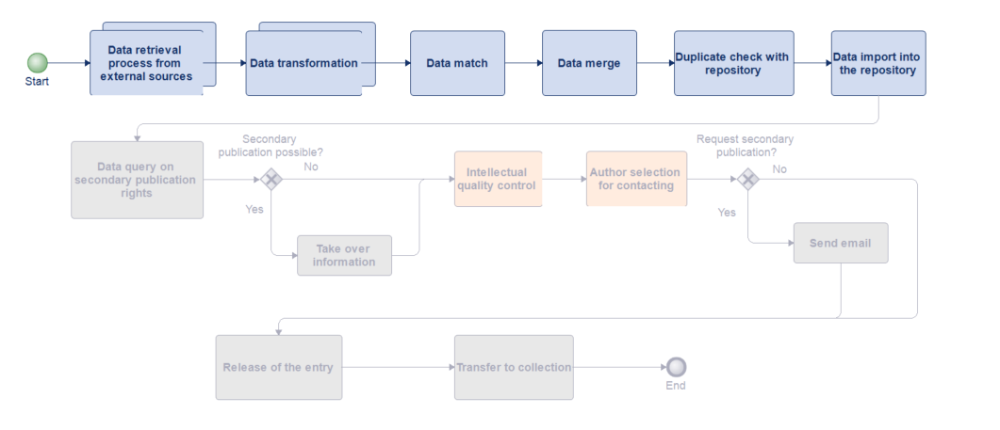
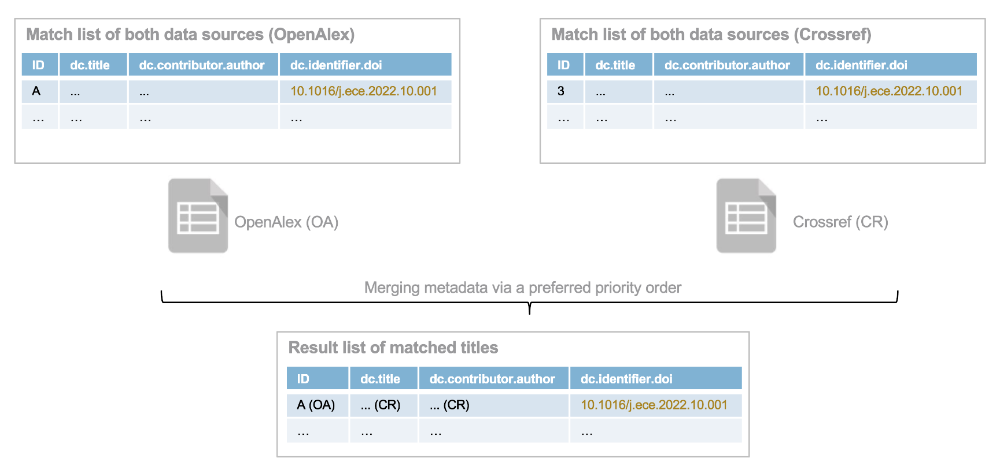

# Aurora Publication Finder

## About
The Publication Finder was the first tool to be developed by the ZHAW Zurich University of Applied Sciences and the University of Applied Sciences and Arts Northwestern Switzerland FHNW as part of the AURORA project co-financed by swissuniversities. This tool is designed to identify new scientific publications authored by individuals affiliated with a specific institution (e.g. the ZHAW). It searches large bibliographic databases. The information (descriptive metadata) about these publications is then prepared in such a way that it can be imported into the user's own institutional repository.




## Table of contents

- [Aurora Publication Finder](#aurora-publication-finder)
  - [About](#about)
  - [Table of contents](#table-of-contents)
  - [Sequence of the individual processes](#sequence-of-the-individual-processes)
    - [Data retrieval](#data-retrieval)
    - [Data transformation](#data-transformation)
    - [Match](#match)
    - [Merge (Combining)](#merge-combining)
    - [Duplicate check on the repository](#duplicate-check-on-the-repository)
    - [Import](#import)
  - [Prerequisites](#prerequisites)
  - [Installation](#installation)
  - [Registration of the providers](#registration-of-the-providers)
  - [General configurations](#general-configurations)
    - [Test and CSV configurations](#test-and-csv-configurations)
    - [System configurations](#systemkonfig)
    - [Timestamp configurations](#timestamp-configurations)
  - [Configurations for the data query and data builder](#configurations-for-the-data-query-and-data-builder)
    - [Configuration for organisation](#configuration-for-organisation)
    - [Configuration for provider](#configuration-for-provider)
  - [Configuration for data transformation](#configuration-for-data-transformation)
    - [Structure of the internal model](#structure-of-the-internal-model)
    - [Mapping from provider vocabulary to internal vocabulary](#mapping-from-provider-vocabulary-to-internal-vocabulary)
      - [Values](#values)
      - [Fields](#fields)
      - [Customisation of Java classes](#customisation-of-java-classes)
    - [Mapping from the internal model to the organisational model](#mapping-from-the-internal-model-to-the-organisational-model)
      - [Values](#values-1)
      - [Fields](#fields-1)
      - [Customisation of Java classes](#customisation-of-java-classes-1)
  - [Configuration for the match and merge](#configuration-for-the-match-and-merge)
    - [Match](#match-1)
    - [Merge](#merge)
  - [Duplicate check configuration](#duplicate-check-configuration)
    - [Adaptations in DSpace](#adaptations-in-dspace)
    - [Login configuration](#login-configuration)
    - [Special configurations](#special-configurations)
    - [Customisation of Java classes](#customisation-of-java-classes-2)
  - [Configurations for the import](#configurations-for-the-import)
    - [Adaptations in DSpace](#adaptations-in-dspace-1)
    - [Login configuration](#login-configuration-1)
    - [Fields](#fields-2)
    - [Special configurations](#special-configurations-1)
    - [Customisation of Java classes](#customisation-of-java-classes-3)
  - [Best practice](#best-practice)


<a name="ablauf-der-einzelnen-prozesse"/>

## Sequence of the individual processes

<a name="datenabholung"/>

### Data retrieval
The data retriever fetches publications via external API interfaces from providers such as OpenAlex or CrossRef. The data is checked for affiliations in the data builder and the relevant fields are transferred to an internal data structure.

Configurable files:
- src/main/resources/assets/config/organisation.properties


<a name="datentransformation"/>

### Data transformation
Two transformations are carried out during the data transformation process. Firstly, the provider-specific data is transferred to logical data records in the internal data structure. Then the data is transferred from the internal model to an organisational model.


Configurable files:
- src/main/resources/assets/config/{providername}.json
- src/main/resources/assets/config/organisation.json


<a name="match"/>

### Match
Once the data has been adapted to the institution's requirements, a data matching process is initiated to search for duplicates among the publications from various providers.

Configurable files:
- src/main/resources/assets/config/organisation.properties


<a name="merge"/>

### Merge (Combining)
The duplicates found are then transferred to the data merge, where they are merged into the best possible publication. 
The merged publications are subsequently combined with the data that is only available in a single data source, in order to create a complete list.

Configurable files:
- src/main/resources/assets/config/organisation.json

<a name="dublettenkontrolle-aufs-repositorium"/>

### Duplicate check on the repository
In order to ensure that only data which does not already exist in the repository is imported, a duplicate check is performed with the repository. The comparison takes place via the DOI and title.

Configurable files:
- src/main/resources/assets/config/credentials.properties
- src/main/resources/assets/config/organisation.properties

<a name="import"/>

### Import
After the duplicate check, publications that are not yet in the repository are imported into a separate collection via the API interface. It is recommended to set the visibility of this collection to ‘not public’. Once the respective publications have been published, they can then be moved to the appropriate collection.

Configurable files:
- src/main/resources/assets/config/credentials.properties
- src/main/resources/assets/config/organisation.json
- src/main/resources/assets/config/organisation.properties


<a name="voraussetzungen"/>

## Prerequisites

* Java Version 17
* Repository in DSpace 7+

<a name="installation"/>

## Installation

- Preparations in DSpace - create collection, create user, customise discovery.xml
- Get the project from Github
- Adapt configuration files
- This command can be executed to generate a jar:
  ```
  mvn clean package
  ```
  The file is then located in the target folder.

<a name="registrierung-der-provider"/>

## Registration of the providers
In the publicationfinder\Application.java class the different providers are registered.

For example:<br>
this.registerDataSource(new OpenAlexDataSourceProvider());

<a name="allgemeine-konfigurationen"/>

## General configurations

<a name="testcsvkonfig"/>

### Test and CSV configurations
src/main/resources/assets/config/application.properties
| field name      | description  | mandatory  | example  |
| ------------- | ------------- | ------------- | ------------- |
|csv.eol|The character that determines the end of a line in a CSV.|Yes|\n|
|csv.fieldseparator|The character that separates the columns in a CSV.|Yes|,|
|csv.valueseparator|The character that separates the values within a column on a row in a CSV.|Yes| \| \| |
|testing.enabled|Value that runs the program in test mode. In test mode, the publications are written to CSV and program prints are generated.|Yes|true|

<a name="systemkonfig"/>

### System configurations
src/main/resources/assets/config/organisation.properties
| field name       | description  | mandatory  | example  |
| ------------- | ------------- | ------------- | ------------- |
|externalfile.path|Path in which the output files are to be saved.|Yes|/path/to/output/folder|
|dspace.version|DSpace Version to set how the csrf token is received. |Yes|7.6.0|

<a name="timestampkonfig"/>

### Timestamp configurations
src/main/resources/assets/config/timestamp.txt

The timestamp is used to retrieve publications only from this date onward.

Each time the program runs, the timestamp is updated to the current date and stored in externalfile.path/timestamp.txt. This prevents querying previously filtered data again.

If the file in externalfile.path does not exist, the timestamp from src/main/resources/assets/config/timestamp.txt is used instead.

<a name="konfigurationen-für-die-datenabfrage-und-datenbuilder" />

## Configurations for the data query and data builder

When searching for new publications, various providers can be selected. In this case, these are OpenAlex and Crossref. Configurations for these providers are stored in the file src/main/resources/assets/config/organisation.properties.<br>
Additionally, information about your institution is also stored in this file.

<a name="konfiguration-zur-organisation"/>

### Configuration for organisation

src/main/resources/assets/config/organisation.properties

| field name      | description  | mandatory  | example  |
| ------------- | ------------- | ------------- | ------------- |
| organisation.rors	 | Organisation ROR ID as URL.	 | Yes | https://ror.org/1234 |
| organisation.repositoryAPIUrl | 	Server API URL of the repository. | Yes | https://digitalcollection.zhaw.ch/server/api |
|organisation.affiliations.exceptions|Names of the institutions which should not be taken into account. Different spellings or institutions are separated with \|\ and a new line.|No|ON exception\|\ <br>Organisation Name Exception <br><br>Concrete example: <br>Zurich University of Applied Sciences in Business Administration|

<a name="konfiguration-zur-provider"/>

### Configuration for provider

src/main/resources/assets/config/organisation.properties

To add providers, the mandatory fields listed below must be defined.

{providerName}: should be replaced with the appropriate name, such as "openalex" or "crossref".

| field name      | description  | mandatory  | example  |
| ------------- | ------------- | ------------- | ------------- |
|{providerName}.id	|Provider-specific field name that fulfils the ID functionality.	|Yes	|openalex.id = id <br> crossref.id = DOI |
|{providerName}.affiliations	|Name of the institution for which the provider is searching. Different spellings or institutions are separated with \|\ and a new line.	|Yes	|openalex.affiliations = ZHAW\|\ <br> Zurich University of Applied Sciences|
|{providerName}.url.affiliations	|The URL of the provider API to search publications for affiliation.	|Yes	|openalex.url.affiliations = https://api.openalex.org/works?filter=raw_affiliation_strings.search:|
|{providerName}.url.ror	|The URL of the provider API to search publications by ROR ID.	|Yes	|openalex.url.ror = https://api.openalex.org/works?filter=institutions.ror:|
|{providerName}.maxItemField	|Field that stores the maximum number of entries per page.	|Yes	|openalex.maxItemField = per_page|
|{providerName}.maxItem	|Field that defines the maximum number of entries per page.	|Yes	|openalex.maxItem = 200|
|{providerName}.nextCursorField	|Field that saves the next cursor.	|Yes	|openalex.nextCursorField = next_cursor|
|{providerName}.startCursor	|Initial value of the cursor for cursor paging. The cursor determines the next page.	|Yes	|openalex.startCursor = *|
|{providerName}.fromDateField	|Field that restricts the publications to a specific date.	|Yes	|openalex.fromDateField = from_publication_date|
|{providerName}.connectionElement	|Field which is used to connect queries in the URL.	|Yes	|openalex.connectionElement = ,|
|{providerName}.metadata	|Field where the metadata is stored in the response.	|Yes	|openalex.metadata = meta|
|{providerName}.itemsSection	|Section where the entries are stored.		|Yes	|openalex.itemsSection = results|

<a name="konfigurationen-für-die-datentransformation"/>

## Configuration for data transformation

The metadata obtained is converted from the provider's format into an internal model during the data transformation process. The data is then transformed from the internal model into an organisational model.

<a name="aufbau-des-internen-models"/>

### Structure of the internal model
The internal model is used to map the provider-specific field names to a standardised value that can be used for further processing. If a new provider is added, only an assignment to the internal model needs to be made. The rest of the program remains unaffected.

| field name      | description  |
| ------------- | ------------- | 
|id|identifier of the publication|
|authors|authors|
|editors|editors|
|dateIssued|Year of publication|
|DOI|Digital Object Identifier |
|ISBN|International Standard Book Number|
|ISSN| International Standard Serial Number |
|language|Language|
|publisher|Publisher|
|publisherType|Type of parent work|
|relationsIspartof|Title of the parent work|
|licenses|Licences|
|title|Title|
|type|Type of publication|
|publicationStatus|publication status|
|volume|volume|
|issue|booklet|
|pagesStart|Pages: Start of page count|
|pagesEnd|Pages: End of pagination|
|publisherPlace|Publishing location|
|PMID|PubMed ID|
|event|Event|
|abstractText|Abstract|
|OA|OpenAccess Status|

<a name="mapping-von-provider-zu-intern"/>

### Mapping from provider vocabulary to internal vocabulary 

<a name="werte"/>

#### Values

src/main/resources/assets/config/{providername}.json for example openalex.json

| field name      | description  | Values of the internal model  |
| ------------- | ------------- | ------------- |
|types|As {key:value} The key represents the type of publication as specified by the provider. The value indicates the corresponding type in the internal model. <br><br>For example:<br> "article": "journal article"	|journal article<br> book part<br> book<br> doctoral thesis<br> dataset<br> report<br> text<br> other<br> peer review<br> patent<br> editorial<br> corrigendum<br> letter to the editor<br> conference paper<br> conference proceedings<br>preprint<br> journal <br>
|licenses|As {key:value}. The key represents the licence of the publication as specified by the provider. The value indicates the corresponding licence in the internal model.<br><br> For example:<br>"cc-by": "https://creativecommons.org/licenses/by/4.0/" |See src/main/resources/assets/config/crossref.json or src/main/resources/assets/config/openalex.json |
|publication_statuses|As {key:value}. The key represents the publication status of the publication as specified by the provider. The value indicates the publication status in the internal model.<br><br> For example:<br>"publishedVersion":"publishedVersion"	|See src/main/resources/assets/config/openalex.json|
|oa_categories|As {key:value}.  The key represents the OA status of the publication as specified by the provider. The value indicates the OA status in the internal model.<br><br>For example:<br>"gold": "gold"	|gold<br> green<br> hybrid<br> closed<br> bronze|

<a name="felder"/>

#### Fields
src/main/resources/assets/config/{Providername}.json for example openalex.json
| field name | description | example |
| ------------- | ------------- | ------------- |
|field_name|Internal field name	|authors|
|fields|Fields from the provider's publication that provide values for the internal field. The hierarchy of the field is separated with ":".|JSON from OpenAlex:<br>{authorships: { author: {                  display_name: Wert            }}} <br><br>authorships:author:display_name|
|multiple_fields|«true», if several fields are used by the provider to fill an internal field. <br> «false», if only one field is used by the provider.|For «true» all relevant fields must be listed under «fields».<br>"fields": [<br>"primary_location:source:display_name",                       "primary_location:source:host_organization_name"<br>]|
|multiple_values|«true», if there can be multiple values for this field.<br>«false», if there can only be one value for this field.	|"authors"an have multiple authors as a value, so this field is set to «true».|

<a name="anpassung-java-klassen"/>

#### Customisation of Java classes

The class under publicationfinder\Organisation\Providers\\{Providername}\\{Providername}DataSourceProvider.java can overwrite the BaseDataSourceProviderAbstract class for each provider. In our example of OpenAlex and Crossref, the method for the transformation is overwritten in order to generate a provider-specific transformer.


The class under publicationfinder\Organisation\Providers\\{Providername}\Transformer\\{Providername}DataSourceTransformer.java can overwrite the DataSourceTransformerAbstract class for each provider. In our example of Openalex and Crossref, the methods are overwritten to make them provider-specific. 

For example, this could include displaying page numbers in a field or separating last names and first names with a comma.

<a name="mapping-von-intern-zu-organisation"/>

### Mapping from the internal model to the organisational model

<a name="werte-1"/>

#### Values
src/main/resources/assets/config/organisation.json

| field name      | description  | example  |
| ------------- | ------------- | ------------- |
|types|As {key:value}. The key represents the type in the internal model, and the value represents the type in the format used by your institution.	| "journal article": "Beitrag in wissenschaftlicher Zeitschrift"|
|licenses|As {key:value}. The key represents the licence in the internal model, and the value represents the licence in the format used by your institution.	|See src/main/resources/assets/config/organisation.json|
|publication_statuses|As {key:value}. The key shows the publication status of the publication in the internal model, and the value shows the publication status in the format used by your institution.	|See src/main/resources/assets/config/organisation.json|
|oa_categories|As {key:value}. The key represents the OA status in the internal model, and the value represents the OA status in the format used by your institution.		|See src/main/resources/assets/config/organisation.json|
|language|As {key:value}. The key represents the language of the publication as specified by the provider, and the value represents the language in the format used by your institution.|See src/main/resources/assets/config/organisation.json|

<a name="felder-1"/>

#### Fields
| field name | description | example |
| ------------- | ------------- | ------------- |
|field_name|Field name in the format used by your institution.	|dc.contributor.author|
|fields|Internal field names.	|["authors"]|
|multiple_values|True if there are multiple values for this field.	|"dc.contributor.author" can have several authors as a value, so this field is set to true.|

<a name="anpassung-java-klassen-1"/>


#### Customisation of Java classes
The OrganisationFieldsTransformer class transforms the internal model into the model used by your institution. The class inherits from the BaseOrganisationTransformer class. The getter method of the field is overwritten for the fields that require transformation.

<a name="konfigurationen-für-den-match-und-den-merge"/>

## Configuration for the match and merge
The data contained in the organisation model is available for each provider. A match is made to merge the publications. Once the duplicate publications have been recognised, they are merged. The merged publications and the non-duplicated publications per provider are then combined into a list.



<a name="match-1"/>

### Match
src/main/resources/assets/config/organisation.properties
| field name      | description  | mandatory  | example  |
| ------------- | ------------- | ------------- |------------- |
|match.string|The field that checks publications for a match.|Yes|dc.identifier.doi|


<a name="merge-1"/>

### Merge
src/main/resources/assets/config/organisation.json

| field name | description | example |
| ------------- | ------------- | ------------- |
|merge_criteria|The provider name determines which field value takes priority during the merge if the publication field is populated for multiple providers. If the field is populated for only one provider, this value is used.|"crossref"|


<a name="konfigurationen-die-dublettenkontrolle"/>

## Duplicate check configuration
To ensure that only new publications are added to the repository, a duplicate check is carried out with existing publications in the repository. A comparison is first carried out using the DOI, then using the title. The search includes publications from published collections as well as from the workflow, which requires registration via the program.

<a name="anpassung-dspace"/>

### Adaptations in DSpace
In order to query duplicates by DOI and title via the repository API, the DOI filter must be set up in DSpace for both the default and workflow configurations. The title filter already exists for the default, but still needs to be set up for the workflow. The changes are made in the file dspace\config\spring\api\discovery.xml.

```
<bean id="searchFilterTitle" class="org.dspace.discovery.configuration.DiscoverySearchFilter">
        <property name="indexFieldName" value="title"/>
        <property name="metadataFields">
            <list>
                <value>dc.title</value>
            </list>
        </property>
        <property name="isOpenByDefault" value="true"/>
        <property name="pageSize" value="10"/>
    </bean>
```

```
<bean id="searchFilterIdentifierDOI"
    class="org.dspace.discovery.configuration.DiscoverySearchFilterFacet">
        <property name="indexFieldName" value="doi" />
        <property name="metadataFields">
            <list>
                <value>dc.identifier.doi</value>
            </list>
        </property>
    </bean>
```

The two filters have to be referenced in ``<property name="searchFilters">`` for
 `` <bean id="workflowConfiguration" ...>`` and ``<bean id="defaultConfiguration" ...> `` like below:

```
<ref bean="searchFilterIdentifierDOI"/>
<ref bean="searchFilterTitle" />
```


<a name="anmeldekonfiguration"/>

### Login configuration
src/main/resources/assets/config/credentials.properties

The user is required to make queries via the API of the institutional repository during the duplicate check. Rights for the workflows are required.


| field name      | description  | mandatory  | example  |
| ------------- | ------------- | ------------- |------------- |
|username|The user email.|Yes|manumusterperson@muster.ch|
|password|The password of the user.|Yes|admin123|

<a name="spezielle-konfigurationen"/>

### Special configurations
src/main/resources/assets/config/organisation.properties

| field name      | description  | mandatory  | example  |
| ------------- | ------------- | ------------- |------------- |
|organisation.specialCharacters|Special characters in the title. For example, if a title and subtitle are separated (title : subtitle). Is used in the duplicate check to check only up to this character in the title.|Yes| :|

<a name="anpassung-java-klassen-2"/>

### Customisation of Java classes
The OrganisationDuplicateCheck class is customised for institutions, for example, to include a dynamic section for metadata fields.

<a name="konfigurationen-für-den-import"/>

## Configurations for the import

<a name="anpassung-dspace-1"/>

### Adaptations in DSpace
A separate collection is created to facilitate the import process. Workflow roles are assigned for this collection. It is recommended that this collection be hidden (with read rights assigned only to specific groups).

<a name="anmeldekonfiguration-1"/>

### Login configuration
src/main/resources/assets/config/credentials.properties

The user is required to make queries via the API of the institutional repository during the import. Submission rights and collection rights are required.

| field name      | description  | mandatory  | example  |
| ------------- | ------------- | ------------- |------------- |
|username|The user email.|Yes|manumusterperson@muster.ch|
|password|The password of the user.|Yes|admin123|

<a name="felder-2"/>

### Fields
src/main/resources/assets/config/organisation.json

The section and a default value should be stored for each imported field.
| field name | description | example |
| ------------- | ------------- | ------------- |
|section|The section defines the name of the section where the field is located in the submission.|"descriptionclassic"|
|default|Default value for the field.|"Not specified"|

<a name="spezielle-konfigurationen-1"/>

### Special configurations
src/main/resources/assets/config/organisation.properties

| field name      | description  | mandatory  | example  |
| ------------- | ------------- | ------------- |------------- |
|organisation.collectionId|The ID of the collection in which the publications are to be saved in the repository. Is used during import.|Yes|XXXXXXXX-XXXX-XXXX-XXXX-XXXXXXXXXXXX|

<a name="anpassung-java-klassen-3"/>

### Customisation of Java classes
The OrganisationDuplicateCheck class is adapted for the institutions which, for example, have a dynamic section for the metadata fields.

The OrganisationImporter class adapts the import to the institutional repository. Methods can be overwritten by the BaseImporter, for example to adapt the body for the HTTP request or to define individual steps of the submission.

<a name="best-practice-workflow"/>

## Best practice

Once the publications have been imported, depending on the intended workflow, they are sent to quality control or directly to the collection. Further adjustments can then be made in the workflow or as a published publication. At the end, the publication can be moved to a suitable collection in DSpace.
