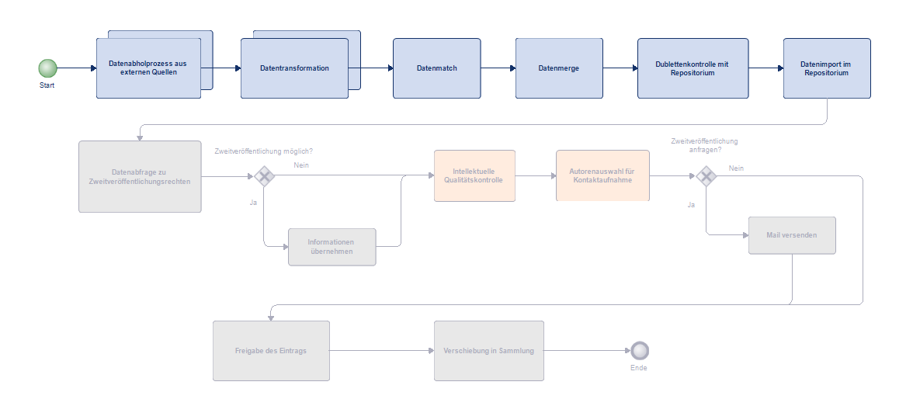
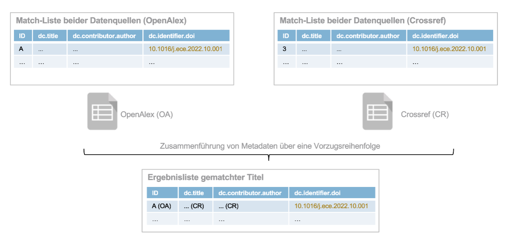

# Aurora Publication Finder

## Über
Der Publication Finder wurde als erstes Tool im von swissuniversities ko-finanzierten Projekt AURORA von der ZHAW Zürcher Hochschule für Angewandte Wissenschaften und der Fachhochschule Nordwestschweiz FHNW entwickelt. Dieses Tool wird verwendet, um neue wissenschaftliche Veröffentlichungen zu finden, bei denen die Autor*innen einer bestimmten Institution (z.B. der ZHAW) angehören. Es durchsucht dazu grosse bibliografische Datenbanken. Die Informationen (beschreibenden Metadaten) über diese Publikationen werden dann so aufbereitet, dass sie in das eigene institutionelle Repositorium importiert werden können.





## Inhaltsverzeichnis

  - [Ablauf der einzelnen Prozesse](#ablauf-der-einzelnen-prozesse)
    - [Datenabholung](#datenabholung)
    - [Datentransformation](#datentransformation)
    - [Match](#match)
    - [Merge](#merge)
    - [Dublettenkontrolle aufs Repositorium](#dublettenkontrolle-aufs-repositorium)
    - [Import](#import)
  - [Voraussetzungen](#voraussetzungen)
  - [Installation](#installation)
  - [Registrierung der Provider](#registrierung-der-provider)
  - [Allgemeine Konfigurationen](#allgemeine-konfigurationen)
    - [Test- und CSV-Konfigurationen](#testcsvkonfig)
    - [Systemkonfigurationen](#systemkonfig)
    - [Timestamp Konfigurationen](#timestampkonfig)
  - [Konfigurationen für die Datenabfrage und Datenbuilder](#konfigurationen-für-die-datenabfrage-und-datenbuilder)
    - [Konfiguration zur Organisation](#konfiguration-zur-organisation)
    - [Konfiguration zu Provider](#konfiguration-zu-provider)
  - [Konfigurationen für die Datentransformation](#konfigurationen-für-die-datentransformation)
    - [Aufbau des internen Models](#aufbau-des-internen-models)
    - [Mapping von Provider zu Intern](#mapping-von-provider-zu-intern)
      - [Werte](#werte)
      - [Felder](#felder)
      - [Anpassung Java Klassen](#anpassung-java-klassen)
    - [Mapping von Intern zu Organisation](#mapping-von-intern-zu-organisation)
      - [Werte](#werte-1)
      - [Felder](#felder-1)
      - [Anpassung Java Klassen](#anpassung-java-klassen-1)
  - [Konfigurationen für den Match und den Merge](#konfigurationen-für-den-match-und-den-merge)
    - [Match](#match-1)
    - [Merge](#merge-1)
  - [Konfigurationen die Dublettenkontrolle](#konfigurationen-die-dublettenkontrolle)
    - [Anpassung DSpace](#anpassung-dspace)
    - [Anmeldekonfiguration](#anmeldekonfiguration)
    - [Spezielle Konfigurationen](#spezielle-konfigurationen)
    - [Anpassung Java Klassen](#anpassung-java-klassen-2)
  - [Konfigurationen für den Import](#konfigurationen-für-den-import)
    - [Anpassung DSpace](#anpassung-dspace-1)
    - [Anmeldekonfiguration](#anmeldekonfiguration-1)
    - [Felder](#felder-2)
    - [Spezielle Konfigurationen](#spezielle-konfigurationen-1)
    - [Anpassung Java Klassen](#anpassung-java-klassen-3)
  - [Best practice](#best-practice-workflow)


<a name="ablauf-der-einzelnen-prozesse"/>

## Ablauf der einzelnen Prozesse

<a name="datenabholung"/>

### Datenabholung
Der Datenabholprozess (Data Retriever) ruft Publikationen über die externen API-Schnittstellen von Anbietern wie OpenAlex oder CrossRef ab. Die Daten werden im Datenbuilder auf die Affiliationen überprüft und die relevanten Felder werden in eine interne Datenstruktur übertragen. 

Konfigurierbare Dateien:
- src/main/resources/assets/config/organisation.properties


<a name="datentransformation"/>

### Datentransformation
In der Datentransformation werden zwei Transformationen durchgeführt. Zuerst werden die anbieterspezifischen Daten zu logischen Datensätzen in der internen Datenstruktur übertragen. Anschliessend werden die Daten aus dem internen Modell in ein Organisationsmodell überführt.


Konfigurierbare Dateien:
- src/main/resources/assets/config/{Providername}.json
- src/main/resources/assets/config/organisation.json


<a name="match"/>

### Match
Nach den Anpassungen der Daten an die Institution wird ein Datenmatch begonnen, der die Publikationen von den verschiedenen Providern auf Dubletten durchsucht.

Konfigurierbare Dateien:
- src/main/resources/assets/config/organisation.properties


<a name="merge"/>

### Merge (Kombinieren)
Die gefunden Dubletten gelangen dann in den Datenmerge, wo diese zu einer bestmöglichen Publikation zusammengeführt werden. Die zusammengeführten Publikationen werden anschliessend wieder mit den nur in einer Datenquelle vorhandenen Daten zu einer Gesamtliste kombiniert.

Konfigurierbare Dateien:
- src/main/resources/assets/config/organisation.json

<a name="dublettenkontrolle-aufs-repositorium"/>

### Dublettenkontrolle aufs Repositorium
Um beim Import nur Daten einzufügen, welche im Repositorium noch nicht existieren, wird eine Dublettenkontrolle mit dem Repositorium gestartet. Der Abgleich findet über den DOI und Titel statt.

Konfigurierbare Dateien:
- src/main/resources/assets/config/credentials.properties
- src/main/resources/assets/config/organisation.properties

<a name="import"/>

### Import
Nach der Dublettenkontrolle werden die bisher nicht im Repositorium vorhandenen Publikationen über die API-Schnittstelle in eine separate Sammlung importiert. Es wird empfohlen, die Sichtbarkeit dieser Sammlung auf «nicht öffentlich» zu setzen. Nach der Veröffentlichung der jeweiligen Publikationen können diese anschließend in die passende Sammlung verschoben werden.

Konfigurierbare Dateien:
- src/main/resources/assets/config/credentials.properties
- src/main/resources/assets/config/organisation.json
- src/main/resources/assets/config/organisation.properties


<a name="voraussetzungen"/>

## Voraussetzungen

* Java Version 17
* Repositorium in DSpace 7+

<a name="installation"/>

## Installation

- Vorbereitungen im DSpace – Sammlung anlegen, User erstellen, discovery.xml anpassen
- Projekt von Github holen
- Konfigurationsdateien anpassen
- Um ein Jar zu generieren kann dieser Befehl ausgeführt werden:
  ```
  mvn clean package
  ```
  Die Datei befindet sich dann im target Ordner.

<a name="registrierung-der-provider"/>

## Registrierung der Provider
In der publicationfinder\Application.java Klasse werden die verschiedenen Provider registriert.

Zum Beispiel:<br>
this.registerDataSource(new OpenAlexDataSourceProvider());

<a name="allgemeine-konfigurationen"/>

## Allgemeine Konfigurationen

<a name="testcsvkonfig"/>

### Test- und CSV-Konfigurationen
src/main/resources/assets/config/application.properties
| Feldname      | Beschreibung  | Pflicht  | Beispiel  |
| ------------- | ------------- | ------------- | ------------- |
|csv.eol|Der Charakter, welcher das Ende einer Zeile in einem CSV bestimmt.|Ja|\n|
|csv.fieldseparator|Der Charakter, welcher die Spalten in einem CSV trennt.|Ja|,|
|csv.valueseparator|Der Charakter, welcher die Werte innerhalb eine Spalte auf einer Reihe in einem CSV trennt.|Ja| \| \| |
|testing.enabled|Wert, welcher das Programm im Testmodus laufen lässt. Im Testmodus werden die Publikationen in CSV geschrieben und Programmprints generiert.|Ja|true|

<a name="systemkonfig"/>

### System Konfigurationen
src/main/resources/assets/config/organisation.properties
| Feldname      | Beschreibung  | Pflicht  | Beispiel  |
| ------------- | ------------- | ------------- | ------------- |
|externalfile.path|Pfad, in dem die Ausgabedateien gespeichert werden sollen.|Ja|/pfad/zum/output/ordner|
|dspace.version|DSpace Version, um festzulegen, wie das csrf-Token empfangen wird. |Ja|7.6.0|


<a name="timestampkonfig"/>

### Timestamp Konfigurationen
src/main/resources/assets/config/timestamp.txt

Der Zeitstempel wird verwendet, um Veröffentlichungen nur ab diesem Datum abzurufen.

Bei jeder Ausführung des Programms wird der Zeitstempel auf das aktuelle Datum aktualisiert und in externalfile.path/timestamp.txt gespeichert. Dadurch wird verhindert, dass zuvor gefilterte Daten erneut abgefragt werden.

Wenn die Datei in externalfile.path nicht existiert, wird stattdessen der Zeitstempel aus src/main/resources/assets/config/timestamp.txt verwendet.

<a name="konfigurationen-für-die-datenabfrage-und-datenbuilder" />

## Konfigurationen für die Datenabfrage und Datenbuilder

Bei der Suche nach neuen Publikationen können verschiedene Provider gewählt werden. In diesem Fall sind es OpenAlex und Crossref. Für diese Provider werden Konfigurationen in der Datei src/main/resources/assets/config/organisation.properties festgehalten.<br>
Zusätzlich werden dort Informationen zur eigenen Institution gespeichert.

<a name="konfiguration-zur-organisation"/>

### Konfiguration zur Organisation

src/main/resources/assets/config/organisation.properties

| Feldname      | Beschreibung  | Pflicht  | Beispiel  |
| ------------- | ------------- | ------------- | ------------- |
| organisation.rors	 | ROR ID einer Organisation als URL.	 | Ja | https://ror.org/1234 |
| organisation.repositoryAPIUrl | 	URL der Server API des Repositoriums. | Ja | https://digitalcollection.zhaw.ch/server/api |
|organisation.affiliations.exceptions|Namen der Institutionn welche nicht berücksichtigt werden sollen. Verschiedene Schreibweisen oder Institutionen werden mit \|\ und einer neuen Linie getrennt.|Nein|ON exception\|\ <br>Organisation Name Exception <br><br>Konkretes Beispiel: <br>Zurich University of Applied Sciences in Business Administration|

<a name="konfiguration-zur-provider"/>

### Konfiguration zu Provider

src/main/resources/assets/config/organisation.properties

Um Provider hinzuzufügen, müssen die unten aufgelisteten Pflichtfelder definiert werden.

{providerName}: durch zum Beispiel openalex oder crossref ersetzen

| Feldname      | Beschreibung  | Pflicht  | Beispiel  |
| ------------- | ------------- | ------------- | ------------- |
|{providerName}.id	|Providerspezifischer Feldname, welches die ID Funktionalität erfüllt.	|Ja	|openalex.id = id <br> crossref.id = DOI |
|{providerName}.affiliations	|Name der Institution, nach welchen beim Provider gesucht wird. Verschiedene Schreibweisen oder Institutionen werden mit \|\  und einer neuen Linie getrennt.	|Ja	|openalex.affiliations = ZHAW\|\ <br> Zurich University of Applied Sciences|
|{providerName}.url.affiliations	|Die URL der Provider-API, um Publikationen nach Affiliation zu suchen.	|Ja	|openalex.url.affiliations = https://api.openalex.org/works?filter=raw_affiliation_strings.search:|
|{providerName}.url.ror	|Die URL der Provider-API, um Publikationen nach der ROR-ID zu suchen.	|Ja	|openalex.url.ror = https://api.openalex.org/works?filter=institutions.ror:|
|{providerName}.maxItemField	|Feld, welches die Maximalzahl der Einträge pro Seite speichert.	|Ja	|openalex.maxItemField = per_page|
|{providerName}.maxItem	|Feld, welches die Maximalzahl der Einträge pro Seite definiert.	|Ja	|openalex.maxItem = 200|
|{providerName}.nextCursorField	|Feld, welches den nächsten Cursor speichert.	|Ja	|openalex.nextCursorField = next_cursor|
|{providerName}.startCursor	|Anfangswert des Cursors beim Cursor Paging. Der Cursor bestimmt die nächste Seite.	|Ja	|openalex.startCursor = *|
|{providerName}.fromDateField	|Feld, welches die Publikationen auf ein Datum einschränkt.	|Ja	|openalex.fromDateField = from_publication_date|
|{providerName}.connectionElement	|Feld, welches als Verbindung von Queries in der URL verwendet wird.	|Ja	|openalex.connectionElement = ,|
|{providerName}.metadata	|Feld, wo die Metadaten in der Response gespeichert sind.	|Ja	|openalex.metadata = meta|
|{providerName}.itemsSection	|Section, wo die Einträge gespeichert sind.	|Ja	|openalex.itemsSection = results|

<a name="konfigurationen-für-die-datentransformation"/>

## Konfiguration für die Datentransformation

Die erhaltenen Metadaten werden in der Daten-Transformation aus dem Providerformat in ein internes Modell umgewandelt. Anschließend werden die Daten aus dem internen Modell in ein Organisationsmodell transformiert.

<a name="aufbau-des-internen-models"/>

### Aufbau des internen Models
Das interne Modell dient dazu, die providerspezifischen Feldnamen auf einen einheitlichen Wert abzubilden, mit denen weitergearbeitet werden kann. Falls ein neuer Provider hinzukommt, muss lediglich eine Zuordnung zum internen Modell erfolgen. Der übrige Programmablauf bleibt davon unberührt.

| Feldname      | Beschreibung  |
| ------------- | ------------- | 
|id|Identifikator der Publikation|
|authors|Autoren|
|editors|Herausgeber|
|dateIssued|Jahr der Veröffentlichung|
|DOI|Digital Object Identifier |
|ISBN|Internationale Standardbuchnummer|
|ISSN|Internationale Standardnummer für fortlaufende Sammelwerke|
|language|Sprache|
|publisher|Verlag |
|publisherType|Typ des übergeordneten Werkes|
|relationsIspartof|Titel des übergeordneten Werkes|
|licenses|Lizenzen|
|title|Titel|
|type|Publikationstyp|
|publicationStatus|Publikationsstatus|
|volume|Band|
|issue|Heft|
|pagesStart|Seiten: Beginn der Seitenzählung|
|pagesEnd|Seiten: Ende der Seitenzählung|
|publisherPlace|Erscheinungsort|
|PMID|PubMed ID|
|event|Event|
|abstractText|Abstrakt|
|OA|OpenAccess Status|

<a name="mapping-von-provider-zu-intern"/>

### Mapping vom Providervokabular zum internen Vokabular 

<a name="werte"/>

#### Werte

src/main/resources/assets/config/{Providername}.json zum Beispiel openalex.json

| Feldname      | Beschreibung  | Werte des internen Models  |
| ------------- | ------------- | ------------- |
|types|Als {key:value}. Der Key zeigt den Typ der Publikation, wie beim Provider angegeben. Value zeigt den Typ im internen Model. <br><br>Beispiel:<br> "article": "journal article"	|journal article<br> book part<br> book<br> doctoral thesis<br> dataset<br> report<br> text<br> other<br> peer review<br> patent<br> editorial<br> corrigendum<br> letter to the editor<br> conference paper<br> conference proceedings<br>preprint<br> journal <br>
|licenses|Als {key:value}. Der Key zeigt die Lizenz der Publikation, wie beim Provider angegeben. Value zeigt die Lizenz im internen Model.<br><br> Beispiel:<br>"cc-by": "https://creativecommons.org/licenses/by/4.0/" |Siehe src/main/resources/assets/config/crossref.json oder src/main/resources/assets/config/openalex.json |
|publication_statuses|Als {key:value}. Der Key zeigt den Publikationsstatus der Publikation, wie beim Provider angegeben. Value zeigt den Publikationsstatus im internen Model.<br><br> Beispiel:<br>"publishedVersion":"publishedVersion"	|Siehe src/main/resources/assets/config/openalex.json|
|oa_categories|Als {key:value}. Der Key zeigt den OA Status der Publikation, wie beim Provider angegeben. Value zeigt den OA Status im internen Model. <br><br>Beispiel:<br>"gold": "gold"	|gold<br> green<br> hybrid<br> closed<br> bronze|

<a name="felder"/>

#### Felder
src/main/resources/assets/config/{Providername}.json zum Beispiel openalex.json
| Feldname | Beschreibung | Beispiel |
| ------------- | ------------- | ------------- |
|field_name|Interner Feldname	|authors|
|fields|Felder aus der Publikation des Providers, welche Werte für das interne Feld bereitstellen. Die Hierarchie des Felds wird mit ":" getrennt.	|JSON aus OpenAlex:<br>{authorships: { author: {                  display_name: Wert            }}} <br><br>authorships:author:display_name|
|multiple_fields|«true», falls mehrere Felder vom Provider verwendet werden, um ein internes Feld zu befüllen. <br> «false», falls nur ein Feld vom Provider verwendet wird.|Bei «true» müssen unter «fields» alle relevanten Felder stehen.<br>"fields": [<br>"primary_location:source:display_name",                       "primary_location:source:host_organization_name"<br>]|
|multiple_values|«true», falls es mehrere Werte für diese Feld geben kann <br>«false», falls es nur einen Wert für dieses Feld geben kann	|"authors" kann mehrere Autoren als Wert haben, daher wird dieses Feld «true» gesetzt.|

<a name="anpassung-java-klassen"/>

#### Anpassung Java Klassen

Die Klasse unter publicationfinder\Organisation\Providers\\{Providername}\\{Providername}DataSourceProvider.java kann für jeden Provider die Klasse BaseDataSourceProviderAbstract überschreiben. In unserem Beispiel von OpenAlex und Crossref wird die Methode für die Transformation überschrieben um einen eigenen providerspezifischen Transformer zu generieren.


Die Klasse unter publicationfinder\Organisation\Providers\\{Providername}\Transformer\\{Providername}DataSourceTransformer.java kann für jeden Provider die Klasse DataSourceTransformerAbstract überschreiben. In unserem Beispiel von Openalex und Crossref werden die Methoden überschrieben um sie providerspezifisch zu  gestalten. 

Zum Beispiel Seitenzahlen in einem Feld darstellen, Nachname und Vorname mit Kommatrennung

<a name="mapping-von-intern-zu-organisation"/>

### Mapping vom internen Modell zum Organisationsmodell

<a name="werte-1"/>

#### Werte
src/main/resources/assets/config/organisation.json

| Feldname      | Beschreibung  | Beispiele  |
| ------------- | ------------- | ------------- |
|types|Als {key: Value}. Der Key zeigt den Typ im internen Model und die Value den Typ im Format der eigenen Institution.	| "journal article": "Beitrag in wissenschaftlicher Zeitschrift"|
|licenses|Als {key:value}. Der Key zeigt die Lizenz im internen Model und die Value die Lizenz im Format der eigenen Institution.	|Siehe src/main/resources/assets/config/organisation.json|
|publication_statuses|Als {key:value}. Der Key zeigt den Publikationsstatus der Publikation im internen Model und die Value den Publikationsstatus im Format der eigenen Institution.	|Siehe src/main/resources/assets/config/organisation.json|
|oa_categories|Als {key:value}. Der Key zeigt den OA Status im internen Model und die Value den OA Status im Format der eigenen Institution.	|Siehe src/main/resources/assets/config/organisation.json|
|language|Als {key:value}. Der Key zeigt die Sprache der Publikation, wie vom Provider angegeben. Value zeigt die Sprache im Format der eigenen Institution.|Siehe src/main/resources/assets/config/organisation.json|

<a name="felder-1"/>

#### Felder
| Feldname | Beschreibung | Beispiel |
| ------------- | ------------- | ------------- |
|field_name|Feldname im Format der eigenen Institution.	|dc.contributor.author|
|fields|Interne Feldnamen.	|["authors"]|
|multiple_values|True, falls es mehrere Werte für dieses Feld gibt.	|"dc.contributor.author" kann mehrere Autoren als Wert haben, daher wird dieses Feld true gesetzt.|

<a name="anpassung-java-klassen-1"/>


#### Anpassung Java Klassen
Die OrganisationFieldsTransformer Klasse transformiert das interne Modell in das Modell der eigenen Institution. Die Klasse erbt von der BaseOrganisationTransformer Klasse. Für die Felder, für die eine Transformation durchgeführt werden soll, wird die Getter-Methode des Feldes überschrieben.

<a name="konfigurationen-für-den-match-und-den-merge"/>

## Konfiguration für den Match und den Merge
Die im Organisationsmodel enthaltenen Daten liegen pro Provider vor. Um die Publikationen zusammenzuführen, wird ein Match gemacht. Nachdem die doppelten Publikationen erkannt wurden, werden diese im Merge zusammengeführt. Die zusammengeführten Publikationen und die pro Provider nicht-doppelten Publikationen werden anschliessend zu einer Liste vereint.



<a name="match-1"/>

### Match
src/main/resources/assets/config/organisation.properties
| Feldname      | Beschreibung  | Pflicht  | Beispiel  |
| ------------- | ------------- | ------------- |------------- |
|match.string|Das Feld, welches Publikationen auf einen Match prüft.|Ja|dc.identifier.doi|


<a name="merge-1"/>

### Merge
src/main/resources/assets/config/organisation.json

| Feldname | Beschreibung | Beispiel |
| ------------- | ------------- | ------------- |
|merge_criteria|Providername um beim Merge für jedes Feld zu entscheiden, welcher Feldwert priorität hat, falls das Feld der Publikation bei mehreren Providern befüllt ist. Ist das Feld nur bei einem Provider belegt, wird dieser Wert genommen.|"crossref"|


<a name="konfigurationen-die-dublettenkontrolle"/>

## Konfiguration Dublettenkontrolle
Damit nur neue Publikationen ins Repositorium gelangen erfolgt eine Dublettenkontrolle mit bereits vorhandenen Publikationen im Repositorium. Zunächst wird ein Vergleich über den DOI durchgeführt, anschließend über den Titel. Die Suche umfasst Publikationen aus veröffentlichten Sammlungen sowie aus dem Workflow, was eine Anmeldung über das Programm voraussetzt.

<a name="anpassung-dspace"/>

### Anpassungen im DSpace
Damit die Dubletten nach dem DOI und dem Titel auf der API des Repositoriums abgefragt werden können, muss im DSpace der Filter DOI für Standard und Workflow eingerichtet werden. Der Filter Titel existiert bereits für im  Default, muss aber für den Workflow noch eingerichtet werden. Die Änderungen erfolgen in der Datei dspace\config\spring\api\discovery.xml.

```
<bean id="searchFilterTitle" class="org.dspace.discovery.configuration.DiscoverySearchFilter">
        <property name="indexFieldName" value="title"/>
        <property name="metadataFields">
            <list>
                <value>dc.title</value>
            </list>
        </property>
        <property name="isOpenByDefault" value="true"/>
        <property name="pageSize" value="10"/>
    </bean>
```

```
<bean id="searchFilterIdentifierDOI"
    class="org.dspace.discovery.configuration.DiscoverySearchFilterFacet">
        <property name="indexFieldName" value="doi" />
        <property name="metadataFields">
            <list>
                <value>dc.identifier.doi</value>
            </list>
        </property>
    </bean>
```

Die zwei Filter müssen im ``<property name="searchFilters">``
des `` <bean id="workflowConfiguration" ...>`` und ``<bean id="defaultConfiguration" ...> `` wie unten referenziert werden:

```
<ref bean="searchFilterIdentifierDOI"/>
<ref bean="searchFilterTitle" />
```


<a name="anmeldekonfiguration"/>

### Anmeldekonfiguration
src/main/resources/assets/config/credentials.properties

Der User wird benötigt um bei der Dublettenkontrolle Abfragen über die API des institutionellen Repositoriums zu machen. Es werden Rechte für die Workflows vorausgesetzt.


| Feldname      | Beschreibung  | Pflicht  | Beispiel  |
| ------------- | ------------- | ------------- |------------- |
|username|Der Benutzeremail des Importusers.|Ja|manumusterperson@muster.ch|
|password|Das Passwort des Importusers.|Ja|admin123|

<a name="spezielle-konfigurationen"/>

### Spezielle Konfigurationen
src/main/resources/assets/config/organisation.properties

| Feldname      | Beschreibung  | Pflicht  | Beispiel  |
| ------------- | ------------- | ------------- |------------- |
|organisation.specialCharacters|Spezialzeichen im Titel. Zum Beispiel, wenn ein Titel und Untertitel getrennt werden (Titel : Untertitel). Wird bei der Dublettenkontrolle verwendet um nur bis zu diesem Zeichen auf den Titel zu prüfen.|Ja| :|

<a name="anpassung-java-klassen-2"/>

### Anpassung Java Klassen
Die OrganisationDuplicateCheck Klasse wird für die Institutionen angepasst, welche zum Beispiel eine dynamische Section bei den Metadatenfeldern hat.

<a name="konfigurationen-für-den-import"/>

## Konfigurationen für den Import

<a name="anpassung-dspace-1"/>

### Anpassungen im DSpace
Damit der Import erfolgen kann, wird eine eigene Sammlung erstellt. Für diese werden die Workflowrollen gesetzt. Es wird empfohlen diese Sammlung versteckt anzuzeigen (Read-Rechte nur für bestimmte Gruppe vergeben)

<a name="anmeldekonfiguration-1"/>

### Anmeldekonfiguration
src/main/resources/assets/config/credentials.properties

Der User wird benötigt um beim Import Abfragen über die API des institutionellen Repositoriums zu machen. Es werden Submissionrechte und Rechte für die Sammlung vorausgesetzt.

| Feldname      | Beschreibung  | Pflicht  | Beispiel  |
| ------------- | ------------- | ------------- |------------- |
|username|Der Benutzeremail des Importusers.|Ja|manumusterperson@muster.ch|
|password|Das Passwort des Importusers.|Ja|admin123|

<a name="felder-2"/>

### Felder
src/main/resources/assets/config/organisation.json

Pro importiertem Feld soll die Section und ein Standardwert hinterlegt werden.
| Feldname | Beschreibung | Beispiel |
| ------------- | ------------- | ------------- |
|section|Die Section definiert den Namen des Abschnitts bei dem das Feld in der Submission liegt.|"descriptionclassic"|
|default|Standardwert für das Feld.|"Not specified"|

<a name="spezielle-konfigurationen-1"/>

### Spezielle Konfigurationen
src/main/resources/assets/config/organisation.properties

| Feldname      | Beschreibung  | Pflicht  | Beispiel  |
| ------------- | ------------- | ------------- |------------- |
|organisation.collectionId|Die ID der Sammlung, in der die Publikationen im Repositorium gespeichert werden sollen. Wird beim Import verwendet.|Ja|XXXXXXXX-XXXX-XXXX-XXXX-XXXXXXXXXXXX|

<a name="anpassung-java-klassen-3"/>

### Anpassung Java Klassen
Die OrganisationDuplicateCheck Klasse wird für die Institutionen angepasst, welche zum Beispiel eine dynamische Section bei den Metadatenfeldern hat.

Die OrganisationImporter Klasse passt den Import an das institutionelle Repositorium an. Methoden können vom BaseImporter überschrieben werden, um zum Beispiel den Body für die HTTP Request anzupassen oder einzelne Schritte der Submission zu definieren.

<a name="best-practice-workflow"/>

## Best practice

Nachdem die Publikationen importiert wurden, gelangen sie abhängig vom vorgesehenen Workflow weiter in die Qualitätskontrolle oder direkt in die Sammlung. Im Workflow oder als veröffentlichte Publikation können dann weitere Anpassungen gemacht werden. Am Ende kann die Publikation in DSpace in eine passende Sammlung verschoben werden.